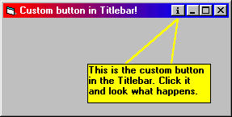



## Custom button in Titlebar \- Updated\!

### Description

This code shows you how to place an own CommandButton into the Titlebar of your program.

Great for special commands in your app.

Easy to implement and a cool thing that will impress your users. Enjoy! AND VOTE FOR ME!

To users of WinNT4 or Win2k: I am sorry I have to tell you that this code won´t work on your system. That might be because NT Technology has got a higher security level and doesn´t allow this program to hook windows.
 
### More Info
 

             |
---                |---
**Submitted On**   |2000-09-07 17:18:52
**By**             |[Druid Developing](https://github.com/Planet-Source-Code/PSCIndex/blob/master/ByAuthor/druid-developing.md)
**Level**          |Intermediate
**User Rating**    |4.5 (59 globes from 13 users)
**Compatibility**  |VB 5\.0, VB 6\.0
**Category**       |[Custom Controls/ Forms/  Menus](https://github.com/Planet-Source-Code/PSCIndex/blob/master/ByCategory/custom-controls-forms-menus__1-4.md)
**World**          |[Visual Basic](https://github.com/Planet-Source-Code/PSCIndex/blob/master/ByWorld/visual-basic.md)
**Archive File**   |[CODE\_UPLOAD9717972000\.zip](https://github.com/Planet-Source-Code/druid-developing-custom-button-in-titlebar-updated__1-11292/archive/master.zip)

### API Declarations

Some.

